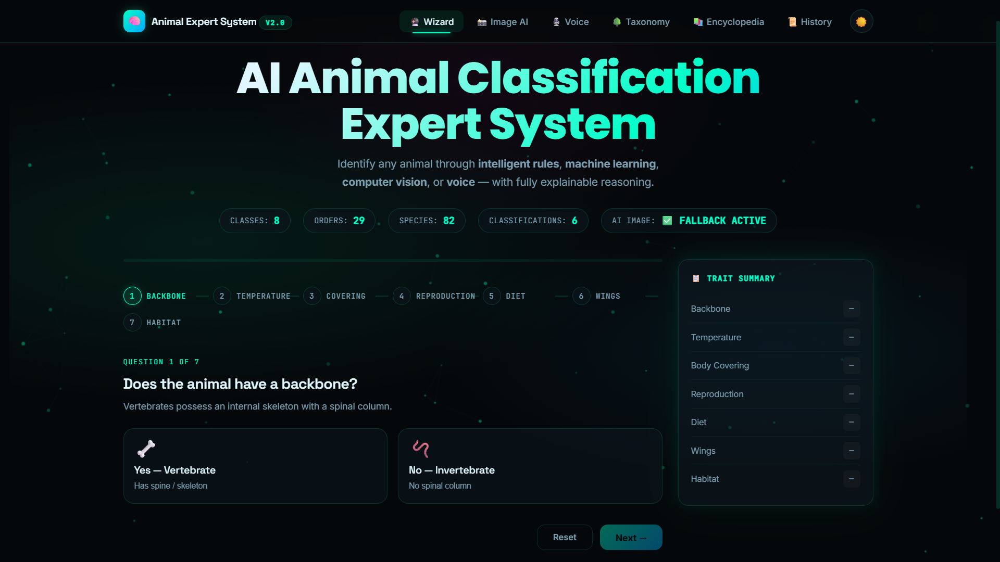
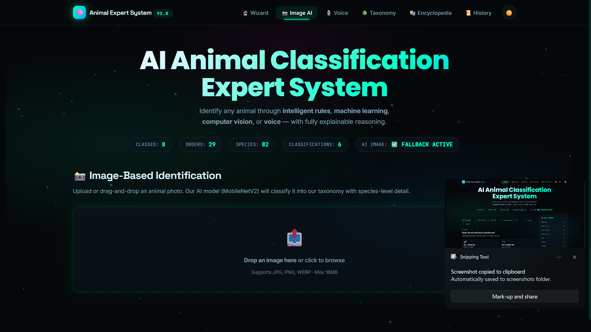
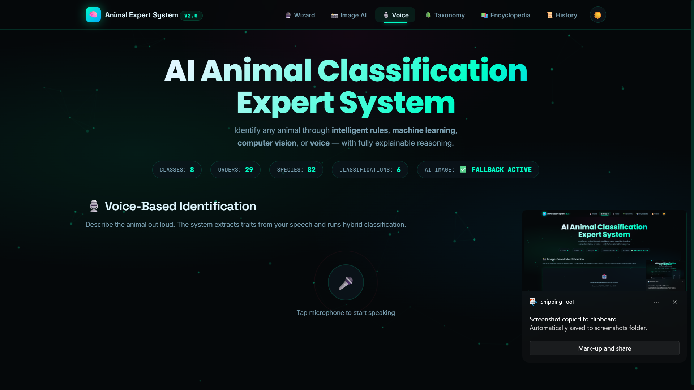
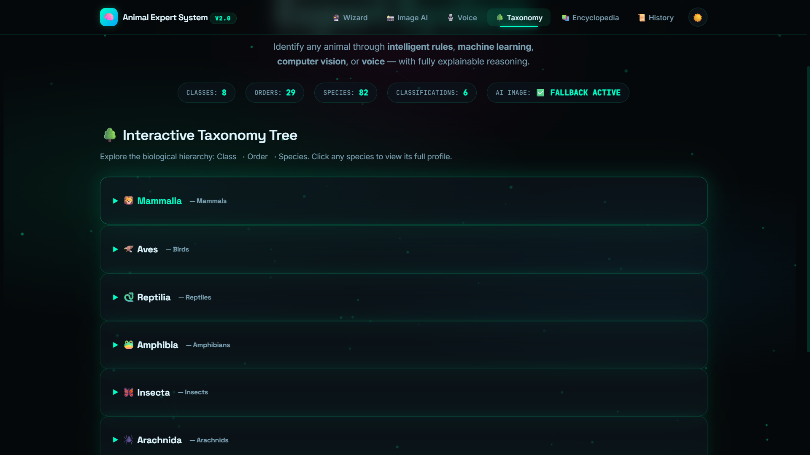
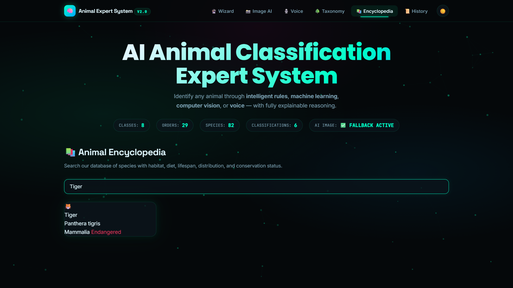
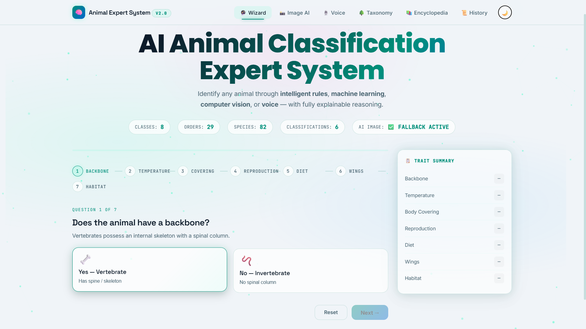

<div align="center">

# 🦁 Animal Classification Expert System v2

**Hybrid AI · Explainable · Computer Vision · Voice · Interactive Taxonomy**

[](https://flask.palletsprojects.com/)
[](https://python.org)
[](https://scikit-learn.org/)
[](LICENSE)

</div>

---

## ✨ Overview

A production-grade **Animal Classification Expert System** combining classical AI (rule-based expert systems) with modern machine learning, computer vision, and natural language processing. Built as a portfolio piece demonstrating full-stack AI engineering skills.

## 📸 Screenshots

| Wizard Classification | Image AI Recognition |
|---|---|
|  |  |

| Voice Input | Taxonomy Tree |
|---|---|
|  |  |

| Encyclopedia | Dark / Light Mode |
|---|---|
|  |  |

## 🚀 Features

| Module | Description | Tech Highlight |
|--------|-------------|----------------|
| **🔮 Trait Wizard** | 7-step guided questionnaire with animated progress | SPA architecture, auto-advance UX |
| **🧠 Hybrid AI** | Forward-chaining rule engine fused with Random Forest ML | Ensemble inference, confidence calibration |
| **🧾 Explainability** | Full reasoning chain showing every triggered rule | XAI (Explainable AI) — critical for trust |
| **📸 Image AI** | Upload any animal photo for instant identification | MobileNetV2 + ImageNet taxonomy mapping |
| **🎙️ Voice Input** | Speak a description; traits are auto-extracted | Web Speech API + heuristic NLP parser |
| **🌳 Taxonomy Tree** | Interactive nested tree: Class → Order → Species | Recursive data viz + dynamic DOM rendering |
| **📚 Encyclopedia** | Searchable database of 20+ species with conservation status, habitat, lifespan | Rich SQLite schema |
| **📜 Audit History** | Complete log of every classification (wizard / image / voice) | Full audit trail for compliance |

## 🛠️ Tech Stack

**Backend**
- **Flask** — REST API + Jinja2 templating
- **SQLite** — relational database with 3NF taxonomy schema
- **scikit-learn** — Random Forest classifier trained on synthetic rule-derived data
- **PyTorch + torchvision** — (optional) MobileNetV2 image recognition

**Frontend**
- Vanilla JS SPA with Canvas particle background
- CSS3: Glassmorphism, backdrop-filter, CSS variables for theming
- Web Speech API for voice recognition
- Drag-and-drop file upload with preview

**AI / ML**
- Expert Systems (forward chaining)
- Hybrid ensemble (rules + ML confidence fusion)
- Pre-trained CNN transfer learning (ImageNet → custom taxonomy)
- Heuristic NLP parsing from speech-to-text

## 📁 Project Structure

```
animal_expert_system_v2/
├── app.py                  # Flask application + all API routes
├── database.py             # SQLite ORM + seed data (20+ species)
├── rule_engine.py          # Forward-chaining expert system with explainability
├── ml_engine.py            # Random Forest hybrid classifier
├── image_classifier.py     # PyTorch MobileNetV2 wrapper + taxonomy mapping
├── requirements.txt        # Python dependencies
├── templates/
│   └── index.html          # Single-page application
├── static/
│   ├── css/
│   │   └── style.css       # Glassmorphism, animations, dark/light mode
│   └── js/
│       └── app.js          # SPA logic, API integration, canvas particles
└── data/
    └── animals.db            # Generated SQLite database
```

## 🚦 Quick Start

```bash
# 1. Clone repository
git clone https://github.com/YOUR_USERNAME/animal-expert-system.git
cd animal-expert-system

# 2. Create virtual environment
python -m venv venv
source venv/bin/activate  # Windows: venv\Scripts\activate

# 3. Install dependencies
pip install -r requirements.txt

# 4. Run application
python app.py

# 5. Open browser at http://127.0.0.1:5000
```

### Optional: Enable Image AI
```bash
pip install torch torchvision --index-url https://download.pytorch.org/whl/cpu
```

## 🎯 Demo Walkthrough

1. **Wizard Mode**: Answer 7 animated questions → get species-level result with confidence % and full rule trace
2. **Image Mode**: Drag a tiger photo → AI returns "Tiger · Panthera tigris · 96% confidence" with habitat & conservation data
3. **Voice Mode**: Say "It has fur, gives live birth, eats meat" → traits extracted → classified as Mammal/Carnivora
4. **Taxonomy Tree**: Click through biological hierarchy and inspect any species profile in a glassmorphism modal
5. **History**: Review every past classification with timestamps and confidence scores


## 📚 Key Concepts Demonstrated

- **Expert Systems**: Rule-based inference with confidence scoring and conflict resolution
- **XAI**: Transparent reasoning chains (not a black box!)
- **Ensemble Learning**: Weighted fusion of symbolic (rules) and sub-symbolic (ML) AI
- **Transfer Learning**: Leveraging ImageNet pre-trained CNN for domain-specific classification
- **Full-Stack Engineering**: REST API design, relational DB schema, SPA architecture, responsive UI

## 🏗️ Future Roadmap

- [ ] Fine-tune custom CNN on domain-specific animal dataset
- [ ] Add user authentication + saved collections
- [ ] Deploy to Render / Railway / AWS Elastic Beanstalk
- [ ] Add 3D model viewer for species anatomy
- [ ] i18n: support Hindi, Spanish, Mandarin

## 📝 License

MIT — feel free to fork, extend, and showcase!

---

<div align="center">
  <b>Built for AI portfolio & technical interviews</b>
  <br>
  <sub>Hybrid Expert Systems · Explainable AI · Computer Vision · NLP</sub>
</div>
